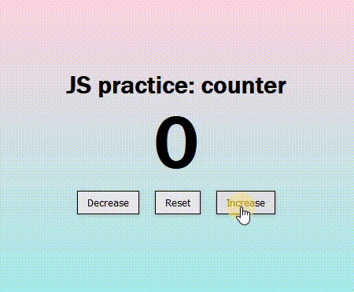

# 🛠 JS - Numbers counter

# 🔗 [Live Preview](https://634996a82b7e0b00b794274d--incredible-syrniki-fdff25.netlify.app/)

## Welcome! 👋

- Simple project where I make a counter with 3 buttons, one that increases the counter number, one that decreases it and one that resets it to zero 

### Languages and features 👨‍💻 

- JS: forEach method, functions, conditional statements.

Thanks for checking out my projects